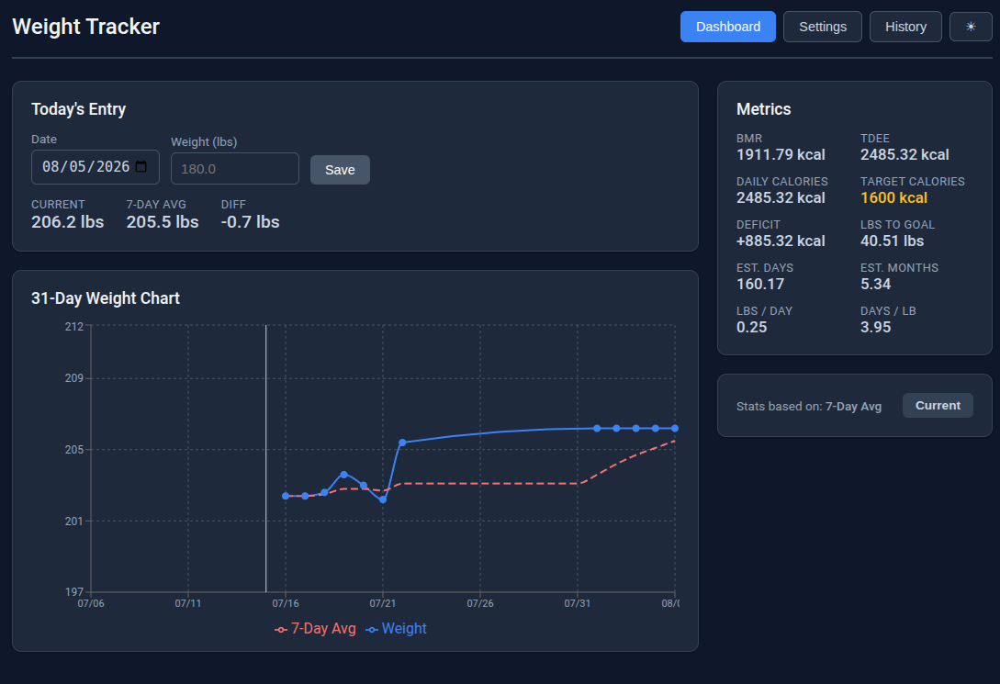

# Weight Tracker



Locally hosted, full-stack weight tracking web app. Log daily weight, view a 31-day graph showing actual weight vs. 7-day rolling average, and see calorie/body-metric projections (BMR, TDEE, deficit, goal timeline).

## Features

- Log, edit, and delete daily weight entries
- 31-day weight chart with actual weight and 7-day rolling average trend line
- Body metric projections: BMR, TDEE, daily deficit, and estimated time to goal
- Toggle between using current weight or 7-day rolling average for metric calculations
- Dark/light theme with automatic system preference detection
- Fully self-contained — single SQLite database, no external services

## Tech Stack

| Layer    | Technology               |
| -------- | ------------------------ |
| Frontend | React 18 + Vite          |
| Backend  | Node.js + Express        |
| Database | SQLite (better-sqlite3)  |
| Charts   | Recharts                 |

## Getting Started

```bash
npm install
npm run install:all
npm run dev
```

- Frontend: http://localhost:5173
- API server: http://localhost:3001

## Production

```bash
npm run build
npm start
```

Serves the built React app from Express on port 3001.

## API Endpoints

### Weight Entries

| Method | Path               | Body / Params                    | Response                           |
| ------ | ------------------ | -------------------------------- | ---------------------------------- |
| GET    | /api/weights       | —                                | `{ data: [{date, weight}, ...] }`  |
| POST   | /api/weights       | `{ date, weight }`               | `{ data: {date, weight} }`         |
| DELETE | /api/weights/:date | —                                | `{ success: true }`                |

### Settings

| Method | Path          | Body (partial)                    | Response           |
| ------ | ------------- | --------------------------------- | ------------------ |
| GET    | /api/settings | —                                 | `{ data: {...} }`  |
| PUT    | /api/settings | any subset of settings fields     | `{ data: {...} }`  |

Settings fields: `height`, `goalWeight`, `age`, `gender`, `activityLevel`, `useAvgWeight`.

### Metrics

| Method | Path         | Response                                                                     |
| ------ | ------------ | ---------------------------------------------------------------------------- |
| GET    | /api/metrics | `{ currentWeight, avg7Day, bmr, tdee, deficit, lbsLeft, daysLeft, monthsLeft }` |

## Project Structure

```
weight-tracker/
├── package.json              # Root orchestration scripts
├── server/
│   ├── package.json
│   ├── index.js              # Express app entry point
│   ├── db.js                 # SQLite database setup and migrations
│   └── routes/
│       ├── weights.js        # Weight CRUD endpoints
│       ├── settings.js       # User settings endpoints
│       └── metrics.js        # BMR/TDEE/goal projection endpoint
└── client/
    ├── package.json
    ├── index.html            # Entry HTML with theme detection
    ├── vite.config.js        # Vite dev server and API proxy config
    └── src/
        ├── main.jsx          # React entry point
        ├── App.jsx           # App shell with routing
        ├── App.css           # All styles (light/dark theme CSS variables)
        ├── api.js            # API client helper
        └── components/
            ├── Dashboard.jsx     # Main layout
            ├── WeightForm.jsx    # Today's weight entry + quick stats
            ├── WeightChart.jsx   # 31-day Recharts line chart
            ├── MetricsPanel.jsx  # BMR/TDEE/deficit/goal display
            ├── SettingsForm.jsx  # Settings editor
            └── HistoryTable.jsx  # Scrollable history with delete
```
